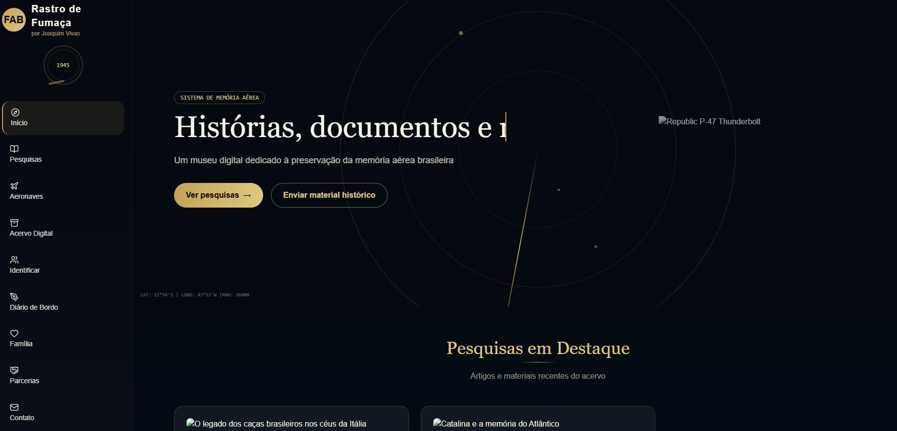
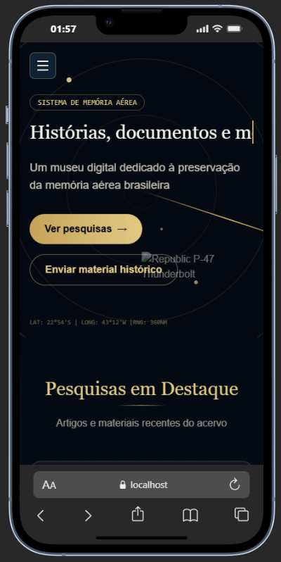

# Rastro de Fumaça — Guia Prático de Desenvolvimento


[📘 Explicação técnica do projeto](doc/Explicacao-tecnica-do-projeto.md)

## 📦 Release

- Versão inicial: [v0.1.0](https://github.com/Joshpcbrrj/rastro-de-fumaca/releases/tag/v0.1.0) — arquivo anexado: `rastro-de-fumaca-v0.1.0.zip` (baixar na página de Releases).

## Sumário

- [🖥️ Demonstração](#demonstração)
- [Uso rápido](#uso-rápido)
- [Acesso restrito](#acesso-restrito)
- [Scripts principais](#scripts-principais)
- [Modificações feitas](#modificações-feitas)
- [Change log](#change-log)
- [Roadmap](#roadmap)
- [Agradecimentos](#agradecimentos)

## 🖥️ Demonstração

<div align="center">

| Desktop (web) | Mobile |
|:-------------:|:------:|
|  |  |

*Capturas de tela: preview web (esquerda) e versão mobile (direita).* 

---

</div>

## Uso rápido

1. Instale as dependências:
   ```bash
   npm install
   ```
2. Rode o projeto em modo de desenvolvimento:
   ```bash
   npm run dev
   ```
3. Abra no navegador:
   ```
   http://localhost:3001
   ```
4. Para rodar o build de produção:
   ```bash
   npm run build
   ```
5. Para testar:
   ```bash
   npm test
   ```
6. Para limpar artefatos antigos:
   ```bash
   npm run clean
   ```

## Acesso restrito

- A senha inicial usada na tela de entrada é: `p-47`
- Esse acesso está implementado no arquivo `app/page.tsx` como proteção local para a página inicial.

## Scripts principais

- `npm run dev` — inicia o servidor Next.js em desenvolvimento na porta `3001`
- `npm run build` — limpa e gera o build de produção
- `npm run clean` — remove a pasta `.next`
- `npm test` — executa o Vitest e valida os testes smoke do projeto

## Modificações feitas

- Projetado com **Next.js 14 App Router** + **TypeScript** + **Tailwind CSS**
- Adicionada proteção de build com guard `Supabase` para evitar falha em Edge/runtime
- Implementado login local de senha e intro cinemática em `app/page.tsx`
- Inseridos componentes de layout e preview: sidebar, radar, hero, artigos e modal
- Adicionado `next.config.mjs` para corrigir nome de chunks de servidor em produção
- Criado `.gitignore` com regras padrão para Next.js/Node
- Incluído `Vitest` e testes iniciais em `tests/`
- Convertido o guia original para `README.md` com documentação compartilhável

Observações das modificações recentes:
- Adicionados guards (noop stubs) para clientes Supabase durante build/prerender.
- Tailwind + estilos globais organizados em `app/globals.css`.
- Testes iniciais adicionados em `tests/` (Vitest + checks node).
- Documento original movido para este `README.md` para facilitar compartilhamento.

> Se o build ou o dev travar por causa de artefatos antigos, remova a pasta `.next` e reinicie o comando.
>
> Exemplo:
> ```bash
> rm -rf .next
> npm run build
> ```

---

<!-- Conteúdo original do Guia Prático de Desenvolvimento -->

(O conteúdo do guia original foi preservado abaixo.)

---

---
# Guia Prático de Desenvolvimento — Rastro de Fumaça
updated: 2026-06-06 03:05:11Z
created: 2026-06-06 02:29:37Z
latitude: -22.79071160
longitude: -43.36993770
altitude: 0.0000
---

# Guia Prático de Desenvolvimento — Rastro de Fumaça
* Projeto: Rastro de Fumaça — Plataforma Histórica da Aviação Brasileira
* Cliente: Joaquim Vivas
* Abordagem: Desenvolvimento manual passo a passo no VS Code
* Tecnologias: Next.js 14+ (App Router), TypeScript, Tailwind CSS, Supabase
* Base de partida: Preview HTML funcional (você já tem o arquivo)

## **Índice de Etapas**

| **Etapa** | **Descrição** | **Tempo estimado** |
| --- | --- | --- |
| 0 | Setup do ambiente e criação do projeto | 20 min |
| 1 | Configuração do Tailwind e tema visual | 30 min |
| 2 | Migração do layout base (CockpitSidebar + estrutura) | 1h |
| 3 | Migração das animações e estilos especiais | 1h |
| 4 | Componentes da Home (Hero, Radar, P-47) | 1h30 |
| 5 | Componentes de conteúdo (Cards, Modal, Artigos) | 1h30 |
| 6 | Dados mockados e páginas dinâmicas | 1h |
| 7 | Autenticação com Supabase | 1h30 |
| 8 | Painel administrativo (CRUD) | 2h |
| 9 | Deploy e ajustes finais | 1h |

**Total estimado:** 10-12 horas (pode variar conforme sua familiaridade)
  
## **Contribuição e instalação**

### ✅ Requisitos

- Node.js `>= 18.17.0`
- npm `>= 10`
- Alternativas compatíveis: `yarn`, `pnpm`

### 🚀 Como clonar

```bash

cd "Projeto site do bruno"
```

### 🔧 Instalação de dependências

```bash
npm install
```

Se preferir outro gerenciador de pacotes:

```bash
## **Etapa 1: Configuração do Tailwind e tema visual**
```

```bash
pnpm install
```

> Use `npm ci` em ambientes de CI para instalar exatamente as versões bloqueadas em `package-lock.json`.

### ▶️ Executando localmente

```bash
npm run dev
```

Abra no navegador:

```text
http://localhost:3001
```

### 🧪 Executando testes

```bash
npm test
```

### 📦 Build de produção

```bash
npm run build
npm start
```

### 🧹 Limpeza de artefatos

```bash
npm run clean
```

### 📝 Variáveis de ambiente

- Se o projeto precisar de variáveis no futuro, copie:
  ```bash
  cp .env.example .env
  ```
- Preencha as chaves necessárias.
- Atualmente o app funciona localmente sem Supabase configurado porque existem guards de build.

## **Change log**

- ✅ Projeto inicial configurado com **Next.js + TypeScript + Tailwind**
- ✅ Acesso protegido por senha local implementado (`p-47`)
- ✅ `next.config.mjs` adicionado para correção de chunks em produção
- ✅ `.gitignore` criado para Next.js / Node
- ✅ `Vitest` integrado com testes smoke iniciais
- ✅ Documentação consolidada em `README.md` para onboarding e colaboração

## **Roadmap**

- Finalizar páginas de admin e login
- Substituir o acesso local de senha por autenticação real via Supabase
- Adicionar conteúdo real ao acervo, imagens e artigos
- Refatorar estilos do preview para maior fidelidade visual
- Implementar testes adicionais para componentes, fluxo e navegação

## **Agradecimentos**

- Projeto desenvolvido com **Vive Code**.
- Ajuda de IA utilizada:
  - **GitHub Copilot** (Raptor mini Preview) para sugestões de código e revisão
- Obrigado por colaborar! Use este README como guia principal para clonar, configurar e rodar o projeto com consistência.

---

Nesta etapa, o foco é deixar o tema visual pronto para o app com o esquema de cores e as classes utilitárias personalizadas.

- Confirme a instalação do Tailwind e PostCSS no `package.json`.
- Em `tailwind.config.ts` ou `tailwind.config.js`, defina o conteúdo como `['./app/**/*.{js,ts,jsx,tsx}', './components/**/*.{js,ts,jsx,tsx}']`.
- Em `app/globals.css`, mantenha:
  - `@tailwind base;`
  - `@tailwind components;`
  - `@tailwind utilities;`
- Adicione variáveis de cor e classes customizadas para o tema:
  - `bg-navy-950`, `bg-navy-900`, `text-paper-100`, `text-gold-400`, `border-gold-400/30`.
  - Classes de painel como `.section-panel`, `.glass-panel`, `.scanline-overlay`.
- Organize o estilo global para o fundo do site, tipografia e animações de scanline, radar e brilho.

## **Etapa 2: Estrutura do layout e navegação**

- O arquivo `app/layout.tsx` define o layout raiz e importa `app/globals.css`.
- O `body` deve incluir classes de cor, tipografia e estilo base, como `bg-navy-950 text-paper-100`.
- Adicione a sidebar responsiva em `components/layout/CockpitSidebar.tsx`.
- Inclua suporte a menu mobile e navegação por seções.
- A página principal `app/page.tsx` carrega o processo de autenticação local, a intro cinemática e os componentes do home.

## **Etapa 3: Componentes de interface e animações**

- `components/home/HeroRadar.tsx`
  - Exibe o hero principal com o radar e o título animado.
  - Faz uso de classes de efeito de digitação e background customizado.
- `components/home/FeaturedResearch.tsx`
  - Mostra cards de pesquisa e um modal de artigo.
- `components/home/CinematicIntro.tsx`
  - Implementa a tela de introdução com progresso e skip.
- `components/articles/ArticleModal.tsx`
  - Gerencia a exibição do artigo em modal, bloqueio de scroll e escape para fechar.

## **Etapa 4: Autenticação e fluxo de acesso**

- O app usa um acesso local de senha em `app/page.tsx` para proteger o conteúdo inicial.
- A senha atual é `p-47`.
- Esse mecanismo é útil para testar o acesso sem precisar do Supabase configurado.
- O fluxo padrão é:
  1. O usuário abre a página.
  2. Digita a senha no formulário.
  3. Se a senha estiver correta, o conteúdo é exibido.

## **Etapa 5: Suporte Supabase para build e fallback**

- Para evitar falhas de build quando o Supabase não está configurado, o projeto inclui stubs de cliente no `lib/supabase`.
- `lib/supabase/client.ts` e `lib/supabase/server.ts` expõem funções mínimas usadas pelo app, como `auth.signInWithPassword`, `auth.getUser` e `from().select()`.
- Esse guard permite que o projeto compile e rode localmente enquanto a integração real com Supabase é desenvolvida.

## **Etapa 6: Testes e validação**

- O projeto já inclui Vitest para testes de unidade e smoke tests.
- Execute:
  ```bash
  npm test
  ```
- O teste padrão valida a configuração básica do app e garante que o ambiente esteja consistente.
- Mantenha as verificações de estilo e guarda de Supabase para evitar regressões.

## **Etapa 7: Build e produção**

- Use `npm run build` para gerar o build de produção.
- Antes de rodar o build, `npm run clean` remove a pasta `.next` e limpa artefatos antigos.
- `next.config.mjs` foi configurado para corrigir a resolução de chunks do servidor em produção, evitando erros de módulo ausente.
- Para iniciar o build de produção localmente, use:
  ```bash
  npm start
  ```

## **Etapa 8: Colaboração e instalação**

- Clone o repositório para o seu computador:
  ```bash
  git clone https://github.com/SEU-USUARIO/SEU-REPO.git
  cd "Projeto site do bruno"
  ```
- Use um ambiente compatível com:
  - Node.js `>= 18.17.0`
  - npm `>= 10` (ou `yarn` / `pnpm` compatível)
- Instale as dependências com:
  ```bash
  npm install
  ```
- Se preferir outro gerenciador de pacotes:
  ```bash
  yarn install
  ```
  ou
  ```bash
  pnpm install
  ```
- Para garantir versões consistentes, mantenha o `package-lock.json` no repositório e use `npm ci` em ambientes de CI.
- Comandos principais:
  ```bash
  npm run dev
  npm test
  npm run build
  npm run clean
  ```
- O projeto roda localmente em:
  ```
  http://localhost:3001
  ```
- Se o projeto exigir variáveis de ambiente no futuro:
  - copie `.env.example` para `.env`
  - preencha as chaves necessárias
  - atualmente, o app funciona localmente sem Supabase configurado porque existem guards de build.

## **Changelog**

- ✅ Configurado o projeto com Next.js + TypeScript + Tailwind
- ✅ Implementado acesso protegido por senha local (`p-47`)
- ✅ Adicionado `next.config.mjs` para correção de chunks em produção
- ✅ Criado `.gitignore` com regras de Next.js / Node
- ✅ Integrado `Vitest` com testes iniciais e validação smoke
- ✅ Documentação consolidada em `README.md` com instruções de uso e onboarding

## **Próximos passos**

- Completar as páginas de admin e login se ainda não estiverem finalizadas
- Substituir o acesso local de senha por autenticação real usando Supabase
- Adicionar conteúdo real ao acervo, imagens e artigos
- Refatorar os estilos do preview para aproximar da experiência visual desejada
- Implementar testes adicionais para componentes, fluxo e navegação

## **Agradecimentos**

- Este projeto foi desenvolvido com Vive Code.
- Ajuda de IA utilizada:
  - GitHub Copilot (Raptor mini Preview) para sugestões de código e revisão
- Obrigado por colaborar! Siga este README para clonar, instalar e rodar o projeto de forma consistente.

---
